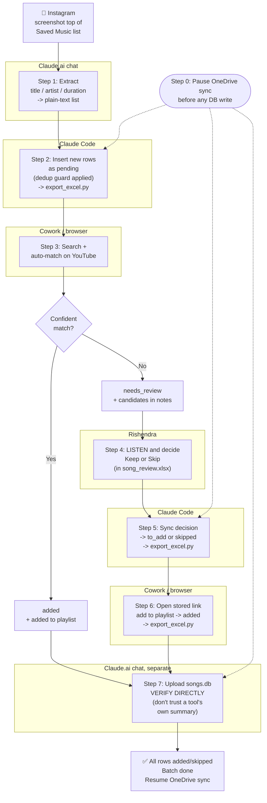
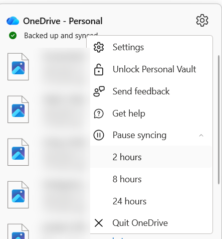
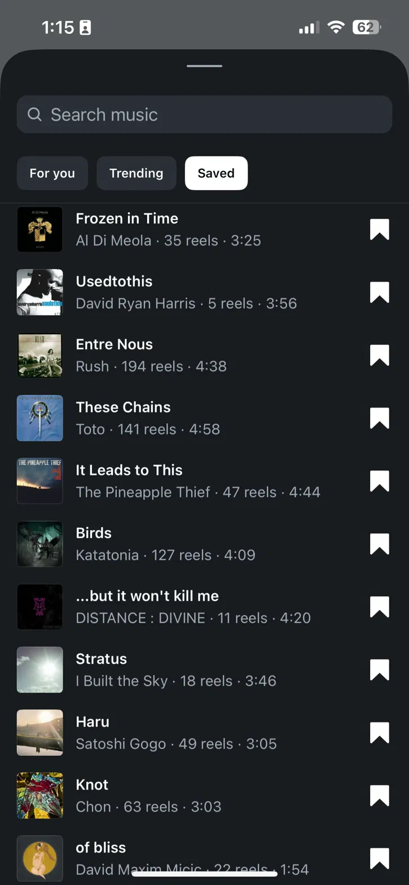
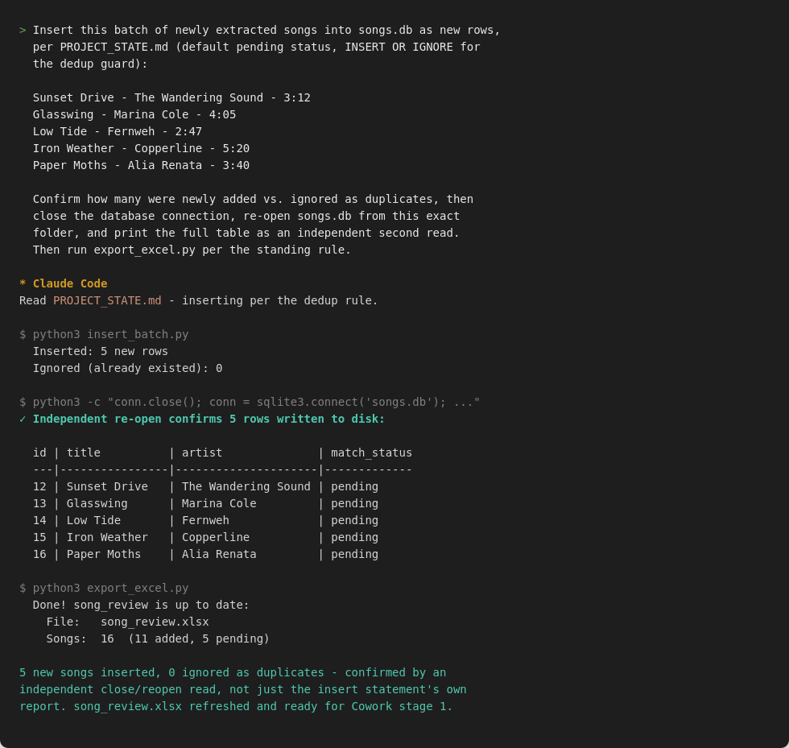
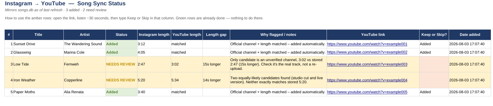
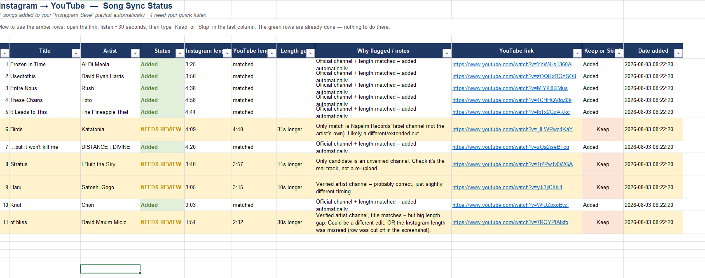
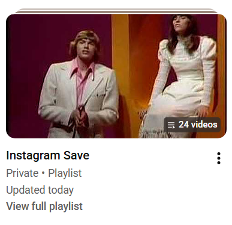
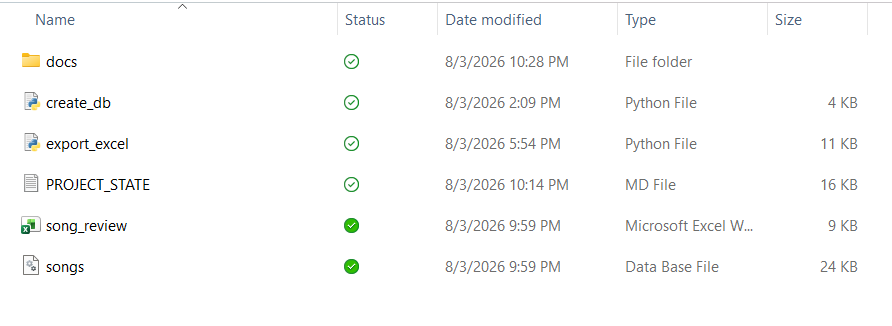

# PROJECT_STATE.md — Instagram → YouTube Song Pipeline

Read this first, before touching songs.db or export_excel.py. It tells you
the rules of this project so you don't have to guess or reverse-engineer them.

## What this project does

Rishendra saves music on Instagram. Screenshots of the saved list get
turned into rows in a local database (songs.db), matched to YouTube videos,
and added to his "Instagram Save" YouTube playlist. A human (Claude, in a
separate chat) reads the screenshots and extracts song data — that part is
NOT done here in Claude Code. Your job starts once the extracted song list
already exists as plain text (title / artist / duration).

## End-to-end workflow — the full run, in order

This is the whole pipeline, start to finish, across three different
tools. Each step only makes sense once the one before it is done — don't
skip ahead. If you're a fresh Claude Code session picking this project up
cold, this section tells you where in the sequence a given request
usually sits.



*Step 0 (pause OneDrive sync) is shown as a dashed precondition into Steps 2, 5, and 7 — the three steps that write to `songs.db` — rather than as a stage in the main flow, since it's something Rishendra does outside any tool, before each of those steps.

**Step 0 — Rishendra pauses OneDrive sync.**
Before any step below that writes to `songs.db` (steps 2, 5, or 7),
sync must be paused first (system tray → gear icon → "Pause syncing").
See the CRITICAL OneDrive section further down for why. Resume sync only
once the whole run is finished and verified.



**Step 1 — Screenshot, in a separate Claude.ai chat (not Claude Code).**
Rishendra screenshots the *top* of his Instagram "Saved music" list (new
saves land at the top, so this naturally captures only what's new since
last time). He uploads the screenshot in a normal chat conversation.
Claude reads the image and extracts a plain-text list: title, artist,
duration per song. If a row's duration is unreadable (cut off, obscured),
it's left as "(unknown)" rather than guessed — see the Gato precedent.
Output of this step: a plain-text list, handed to Claude Code next.

Example of what this screenshot looks like:



**Step 2 — Insert the batch, in Claude Code.**
Rishendra pastes that list into Claude Code, in this project folder.
Claude Code inserts each song as a new `pending` row using
`INSERT OR IGNORE` (the dedup guard — see "The dedup rule" below),
reports how many were new vs. already-existing duplicates, then runs
`export_excel.py` per the standing rule so there's a current sheet.
Verify by an independent close/reopen read before trusting the insert
count — don't just report what the insert statement claims.

Example of what this looks like in Claude Code (illustrative sample
data, not a real batch) — note the independent re-open read after the
insert, confirming the write actually landed rather than just trusting
the insert statement's own report:



**Step 3 — Cowork stage 1: search and auto-match.**
Rishendra opens Cowork (a browser session, logged into YouTube himself)
and runs the stage-1 prompt (see "The Cowork handoff" below) against the
`pending` rows from step 2. Cowork searches each song, prefers an
official/Topic/verified channel, checks duration within ~5 seconds,
and either adds it to "Instagram Save" (`match_status → added`) or
flags it for review (`match_status → needs_review`, with 2-3 candidate
links saved in `notes`). Ends with `export_excel.py` per the standing
rule, and the browser should close once the DB write is confirmed.

Example of what `song_review.xlsx` looks like right after this step
finishes — note the amber "NEEDS REVIEW" rows have their "Keep or Skip?"
column still blank, since Rishendra hasn't reviewed them yet (this is
illustrative sample data, not a real batch):



**Step 4 — Rishendra reviews the flagged songs.**
For any `needs_review` row, Rishendra opens `song_review.xlsx`, listens
to the candidate link(s) in the amber row, and either types "Keep" (optionally
pasting in a corrected link he found himself, e.g. by searching manually)
or "Skip" into the "Keep or Skip?" column. This step happens outside any
tool — it's Rishendra's own listening judgment, which nothing here can
substitute for.

Example of what this sheet looks like mid-review (green = already added,
amber = needs a listen, with the "Keep or Skip?" column filled in):



**Step 5 — Sync the decision, in Claude Code.**
Rishendra tells Claude Code which song(s) he decided on and what the
outcome was (Keep + which link, or Skip). Claude Code updates that row:
`match_status → to_add` (with the confirmed `youtube_url`/`youtube_video_id`
set) for a Keep, or `match_status → skipped` for a Skip. Then
`export_excel.py` per the standing rule, verified with a close/reopen read.

**Step 6 — Cowork stage 2: add the confirmed songs.**
Rishendra runs the stage-2 prompt in Cowork against the `to_add` rows
from step 5. This is simpler than stage 1 — no searching, no judgment —
Cowork just opens each stored `youtube_url` directly and adds it to
"Instagram Save" (skipping if it's already there), then sets
`match_status → added` and `date_added_to_playlist` to today. Ends with
`export_excel.py` and closing the browser, same as stage 1.

**Step 7 — Final verification.**
Rishendra uploads the current `songs.db` (and optionally `song_review.xlsx`)
to the separate Claude.ai chat, where it gets checked directly — not by
trusting Cowork's or Claude Code's own summary of what it did. This is the
step that actually catches problems (see the OneDrive section below for
why self-reported "verified" isn't always trustworthy). Once every row
reads `added` (or a deliberate `skipped`), the batch is done. Rishendra
resumes OneDrive sync at this point.

The end result — the actual "Instagram Save" YouTube playlist:



*Note: this screenshot shows 24 videos at the time it was taken, while
`songs.db` showed 22 `added` rows. The gap is most likely the one stray
video YouTube auto-saves when a playlist is first created (see "Syncing a
reviewed Excel sheet back into songs.db" precedent), plus possibly one
duplicate from early testing. Worth a one-off manual check of the actual
playlist against the database if this bothers Rishendra, but it isn't
part of the regular pipeline — just a leftover from initial setup/testing.*

Steps 3-6 repeat only for songs that need a second look; most batches
skip straight from step 3 to step 7 if everything auto-matches cleanly.

## Files in this folder

- `songs.db` — the single source of truth. SQLite. Never hand-edit rows in
  a GUI tool without going through the rules below.
- `export_excel.py` — run it any time you want the sheet brought up to date.
  It reads songs.db and **overwrites one single file**, `song_review.xlsx`
  (or `song_review.csv` if the openpyxl add-on isn't installed) — there is
  only ever one current sheet, not a pile of dated snapshots. It's safe to
  re-run even if Rishendra has already typed answers into "Keep or Skip?"
  for review rows and not yet synced them back to the database: the script
  reads the existing sheet first and carries those typed answers forward
  before overwriting, so nothing typed is ever silently lost.
- `song_review.xlsx` (or `.csv`) — the one current sheet. Always mirrors
  songs.db as of the last time export_excel.py was run. Don't treat it as
  a permanent record — the database is the permanent record; this is a view.
- `docs/screenshots/` — reference images for this file (the ones linked
  throughout this document). Not read by any script; documentation only.

What the project folder actually looks like on Rishendra's desktop:



## Database schema (songs table) — do not rename or restructure

```sql
CREATE TABLE songs (
    id                     INTEGER PRIMARY KEY AUTOINCREMENT,
    title                  TEXT NOT NULL,
    artist                 TEXT NOT NULL,
    duration               TEXT,              -- e.g. '4:38', as read off Instagram
    duration_seconds       INTEGER,           -- normalized, e.g. 278
    source                 TEXT DEFAULT 'instagram',
    date_captured          TEXT DEFAULT (datetime('now')),
    youtube_video_id       TEXT,
    youtube_url            TEXT,
    match_status           TEXT DEFAULT 'pending',
    date_added_to_playlist TEXT,
    notes                  TEXT,
    UNIQUE(title, artist)
)
```

## match_status values and what they mean

- `pending` — new song, not yet searched on YouTube.
- `to_add` — a human has picked/confirmed a specific youtube_url for this
  song (usually after a "needs_review" case was manually resolved); it's
  queued for Cowork to open that exact link and save it to the playlist.
- `needs_review` — Cowork searched but couldn't confidently match (no
  official/Topic channel, or duration off by more than ~5s). The `notes`
  field holds candidate link(s) and the reason. Needs a human to listen
  and decide.
- `added` — confirmed in the YouTube playlist. `date_added_to_playlist`
  should be set whenever this status is set.
- `skipped` — human decided not to add it. Leave alone; don't re-process.

## The dedup rule — don't break this

`UNIQUE(title, artist)` is the guardrail against adding the same song
twice. Always insert with `INSERT OR IGNORE` (or equivalent) so re-running
against an overlapping screenshot is safe. This match is EXACT TEXT —
"of bliss" and "Of Bliss" count as different rows. If asked to harden this,
the fix is a normalized (lowercased, trimmed) comparison key — not yet
implemented, ask before adding it.

## Inserting a new batch of extracted songs

Given a plain-text list like:
```
Title — Artist — Duration
```
from a chat session that read a screenshot:

1. Open songs.db.
2. For each song: `INSERT OR IGNORE INTO songs (title, artist, duration,
   duration_seconds) VALUES (...)`, computing duration_seconds as
   `minutes*60 + seconds`.
3. Report back: how many were newly inserted vs. already existed (ignored).
4. Run `export_excel.py` so there's a current snapshot to hand back.

Do not set match_status on insert — it defaults to `pending`, which is
correct; Cowork's stage-1 prompt only processes `pending` rows.

## Excel sheet rules — IMPORTANT, read before touching export_excel.py

The column structure was explicitly approved by Rishendra and must NOT be
changed, reordered, added to, or removed from without him asking first.
A past mistake redesigned these columns without permission — don't repeat it.

Exact column order:
```
#, Title, Artist, Status, Instagram length, YouTube length, Length gap,
Why flagged / notes, YouTube link, Keep or Skip?, Date added
```

- Green rows = `added`. Amber rows = `needs_review`. The "Keep or Skip?"
  column is the one Rishendra hand-types into — never pre-fill it for
  review rows, and never overwrite his answer if reprocessing his
  returned sheet.
- "Date added" in the sheet = `date_captured` (when the song entered the
  DB) — this was a deliberate choice Rishendra confirmed, not
  `date_added_to_playlist`. Don't switch which date this shows without
  asking.

## Syncing a reviewed Excel sheet back into songs.db

If Rishendra hands back a sheet with "Keep or Skip?" filled in (and
possibly a corrected YouTube link pasted over the flagged one):

1. Read the "Keep or Skip?" column per row.
2. `Keep` → set `match_status = 'to_add'`, set `youtube_url` /
   `youtube_video_id` to whatever's in the sheet's link column for that
   row (respect a manually corrected link — it means the human verified
   it by ear), clear `date_added_to_playlist` (it's not on the playlist
   yet — Cowork stage 2 does that next).
3. `Skip` → set `match_status = 'skipped'`. Don't touch its link.
4. Blank → leave as `needs_review`, still pending a decision.
5. Run export_excel.py afterward so the snapshot reflects the new state.

## The Cowork handoff (two stages, run separately, in the browser — not here)

- **Stage 1** — processes `pending` rows: searches YouTube, prefers an
  official "Artist - Topic" / verified channel, checks duration within
  ~5 seconds. Confident match → adds to playlist, sets `added`. No
  confident match → sets `needs_review` with candidate link(s) in `notes`.
- **Stage 2** — processes `to_add` rows only: opens the exact stored
  `youtube_url` (no searching), adds to playlist, sets `added` +
  `date_added_to_playlist`.

Claude Code doesn't run these — Cowork does, driving an actual browser
with Rishendra logged into YouTube himself. Claude Code's role is purely
the database and spreadsheet side, before and after Cowork's browser runs.

**Always close the browser tab/window once all songs for that run are
processed and the database write is confirmed.** Don't leave it open
after a successful run — this should be the last action Cowork takes,
after the database and spreadsheet are already updated and verified.

### Stage 1 prompt — paste as-is into Cowork

```
Read the songs.db file in this folder — it's a SQLite database with a
table called songs. For every song where match_status is pending:

1. Search YouTube for the song using its title and artist.
2. Judge the best match using two things you can see on the page: prefer
   a result from the official "Artist - Topic" channel (or the artist's
   verified channel), and check the video's length is within about 5
   seconds of the duration stored for that song. If duration is blank
   (e.g. a song with no known length), skip the length check and rely on
   channel match plus title/artist alone.
3. Before adding anything, check whether the song is already in
   "Instagram Save" (it may already be there from a previous run whose
   database update didn't save correctly) — if it's already there, don't
   add a duplicate, just update its database row to reflect that.
4. If a result clearly matches and isn't already in the playlist, add it
   to "Instagram Save," then update the row: match_status to added, save
   the video's URL and ID in youtube_url and youtube_video_id, and set
   date_added_to_playlist to today.
5. If nothing clearly matches, do not guess. Set match_status to
   needs_review and put the top 2-3 candidate links in the notes field.
6. Write all database changes directly to songs.db in this exact folder
   — do not work from a copy in /tmp or an "outputs" folder. After
   finishing, close the database connection, then immediately re-open
   songs.db from this same folder and print the full contents back to
   me, so we can both confirm the write actually landed here.
7. I'm already logged into YouTube — don't try to log in or ask for my
   password.
8. When done, run export_excel.py per the standing rule, then close the
   browser. Show me a summary: how many were added, and the list marked
   needs_review with their links.
```

### Stage 2 prompt — paste as-is into Cowork (only after Rishendra has
### reviewed any needs_review rows and Claude Code has set them to to_add)

```
Read songs.db in this folder. For every song where match_status is
to_add: open the URL stored in youtube_url directly (don't search), add
it to my playlist "Instagram Save" (skip if already there, just update
the row instead of adding a duplicate), then set match_status to added
and date_added_to_playlist to today. Write directly to songs.db in this
folder — no scratch copies — then close and re-open it from this same
folder to confirm the write landed. I'm already logged into YouTube.
Run export_excel.py per the standing rule when done, then close the
browser.
```

## CRITICAL — pause OneDrive sync before any Cowork or Claude Code
## session that writes to songs.db

This folder lives in a OneDrive-synced directory. Writing to `songs.db`
or `song_review.xlsx` while OneDrive is actively syncing has repeatedly
caused silent failures: disk I/O errors on read/write, and — worse —
writes that appeared to succeed (even passing internal checksum
comparisons) but never actually landed in the real synced file. This
happened multiple times across a single day of testing before the cause
was found.

**Before starting any session that will modify songs.db:**
1. Rishendra pauses OneDrive sync (system tray icon → gear → "Pause
   syncing" → 2 hours) himself, outside of Claude Code/Cowork.
2. Do the database/Cowork work.
3. Rishendra resumes sync afterward once he's confirmed the results.


If you are Claude Code or Cowork and you hit disk I/O errors on this
path, or a "verified" write doesn't match what Rishendra sees when he
re-uploads the file, **do not just retry with a scratch-copy workaround
and call it fixed** — the checksum-matches-itself trap: comparing a
scratch copy to the file it was copied from proves nothing about whether
the real synced file actually updated. Tell Rishendra to confirm OneDrive
sync is paused before continuing, and ask him to verify the result
independently (checking the file's "Date modified" in File Explorer, or
re-uploading it) rather than trusting an internal check alone.

## Standing rule — always refresh the sheet, without being asked

Any task that changes songs.db (inserting a new batch, syncing Keep/Skip
decisions, updating status after a Cowork run, deleting/fixing rows) ends
by running `export_excel.py`, automatically, as the last step — do not
ask Rishendra whether to do this; it's part of the task, every time.

This is done entirely on the local files in this folder. Never suggest
regenerating the sheet in a separate sandbox/chat session and handing it
back — that defeats the point of running this locally.

## Conventions carried over from Rishendra's other projects

- Verification-first: after any DB write, read the rows back and show
  counts (e.g. "3 inserted, 1 ignored as duplicate") rather than assuming
  success.
- Prefer plain conversational summaries over creating new markdown/report
  files for routine updates.
- Never redesign something that already has an approved structure without
  being asked — check this file's "Excel sheet rules" before any change
  to export_excel.py's columns.
